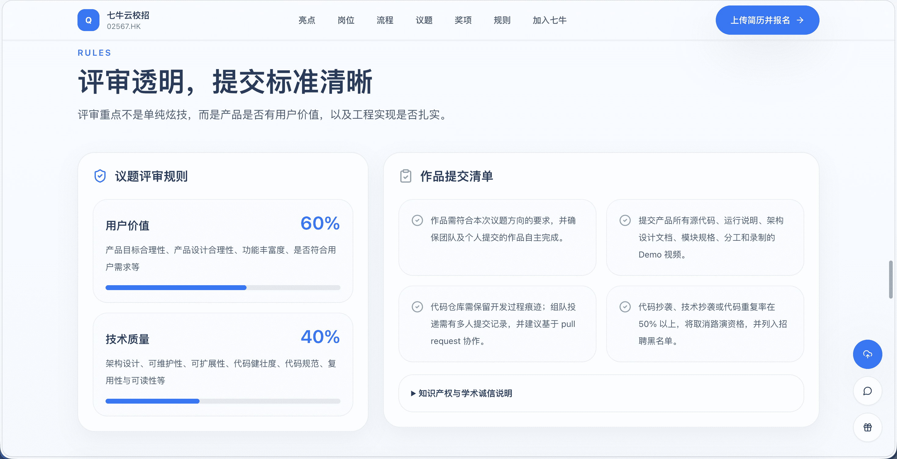

# Qiniu Campus Activity Page Redesign

基于七牛校园活动页内容重新设计的 Web 页面项目。项目采用 Vite、React 和 Tailwind CSS 构建，用于记录一次从内容整理、UI 设计修订到页面工程实现的 vibe coding 实践。

本文档面向 UI 设计师和软件工程师，用于说明项目背景、目录结构、运行方式和交付注意事项。

## 项目背景

项目目标是将已有活动页内容重新整理，并实现为一个可预览、可迭代的页面工程。

原始页面链接：

```text
https://www.qiniu.com/activity/detail/68ac208628614a718ed2319c
```

本次实践关注三个方面：

- 原始页面内容的结构化整理。
- UI 设计师对信息层级、表达重点和页面方向的修订。
- 将页面结果整理为符合 Web 工程交付习惯的代码。

## 工作流程

1. **内容整理**

   从原活动页提取有效信息，整理为结构化 Markdown 文档。

2. **设计修订**

   UI 设计师对内容优先级、模块组织和页面表达进行调整。

3. **页面实现**

   基于修订后的内容生成活动落地页，并继续优化视觉表现、招聘信息展示和活动流程表达。

4. **工程整理**

   整理 Vite + React + Tailwind CSS 项目配置，统一文件命名和目录结构，便于后续协作。

## 技术栈

- Vite
- React
- Tailwind CSS
- lucide-react

## 项目结构

```text
.
├── docs/                  # 内容整理、提示词和设计修订文档
├── src/                   # Web 页面源码
│   ├── components/        # 页面组件
│   ├── data/              # 页面数据
│   ├── App.jsx            # 应用主体
│   ├── main.jsx           # React 入口
│   └── styles.css         # 全局样式
├── index.html             # Vite HTML 入口
├── package.json           # 项目依赖和脚本
├── package-lock.json      # 依赖锁定文件
├── postcss.config.js      # PostCSS 配置
├── tailwind.config.js     # Tailwind CSS 配置
└── vite.config.js         # Vite 配置
```

## 文档说明

- `docs/content.zh.md`：原始内容整理
- `docs/content.designer-revision.zh.md`：UI 设计师修订后的内容整理
- `docs/prompt-01-extract-content.zh.md`：内容提取提示词
- `docs/prompt-01-structure-content.zh.md`：内容结构整理提示词
- `docs/prompt-02-build-landing-page.zh.md`：页面生成提示词
- `docs/prompt-02-build-landing-page.designer-revision.zh.md`：页面生成提示词修订版
- `docs/prompt-03-refine-landing-page.zh.md`：页面优化提示词
- `docs/prompt-03-refine-landing-page.designer-revision.zh.md`：页面优化提示词修订版

## 本地运行

```bash
npm install
npm run dev
```

默认访问地址：

```text
http://127.0.0.1:5173/
```

生产构建：

```bash
npm run build
```

预览构建结果：

```bash
npm run preview
```

## 交付说明

UI 设计师可通过本地预览地址或线上部署链接查看页面效果，并根据 `docs/` 中的内容文档继续调整信息结构和页面表达。

软件工程师可基于当前项目继续开发、部署或接入真实业务逻辑。交付时建议使用 Git 仓库，不提交 `node_modules/` 和 `dist/`。

如需对外展示，可部署 `npm run build` 生成的 `dist/` 目录，或使用 Vercel、Netlify、GitHub Pages 等平台生成在线链接。

## 工程规范

- 文件名使用英文小写、数字、短横线和点分隔。
- 中文内容文档使用 `.zh.md` 作为语言后缀。
- 文档集中放在 `docs/`。
- 源码集中放在 `src/`。
- 页面组件放在 `src/components/`。
- 页面数据放在 `src/data/`。
- 使用 Git / GitHub 管理版本和协作记录。

## 截图展示

